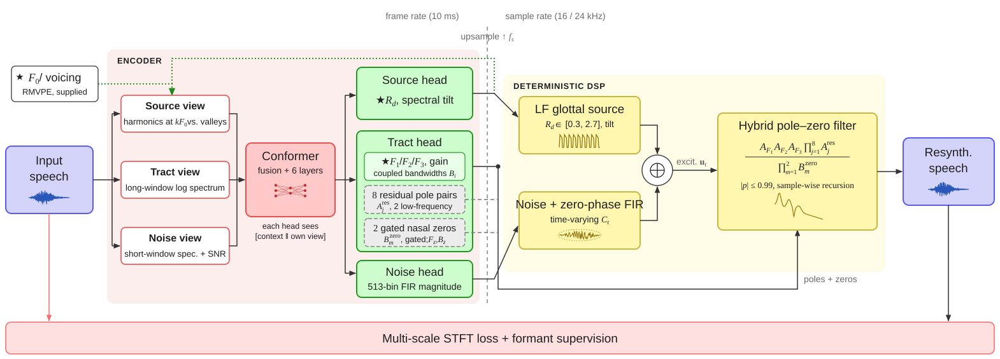

<div align="center">

# ARIS

**Low-Resource Glass-Box Neural Source–Filter Synthesis for Phonetic Stimulus Manipulation**

Yiran Ding and Wenwei Xu · Leiden University Centre for Linguistics (LUCL), Leiden University


[](https://n1r.github.io/ARIS_nsf/)
[](#pretrained-models)
[](pyproject.toml)
[](LICENSE)

</div>

ARIS (*Analytic Resonant Interpretable Synthesis*) resynthesizes speech with
one acoustic cue changed, for example F2 × 1.1, or +2 semitones between 0.3
and 0.7 s.

A neural encoder estimates the parameters of a source–filter synthesizer: an
LF glottal source, a noise source, and a vocal tract with explicit F1–F3
resonators. Only this analysis is learned, so less than an hour of one
speaker's recordings is enough to train a model.

<p align="center"></p>

- Edit F0, F1–F3, the glottal pulse shape R_d and the noise level, globally or
  within a time region.
- Formant edits barely affect the other cues (≤ 0.04 % drift).
- 9.1 M parameters; training takes about 2 h on one consumer GPU.

## Installation

```bash
git clone https://github.com/N1r/ARIS_nsf.git && cd ARIS_nsf
uv sync                             # CPU
uv sync --extra gpu                 # GPU (CUDA 13 driver)
uv sync --extra gpu --extra rmvpe   # GPU + F0 extraction for new recordings
```

ARIS runs on Linux with Python 3.10–3.12 (CPU inference also on macOS).
F0 comes from [RMVPE](https://github.com/yxlllc/RMVPE): clone it, put its
`model.pt` in its `checkpoints/`, and `export ARIS_RMVPE_ROOT=/path/to/RMVPE`.
You can also pass your own F0 track instead.

## Training a model

| | Paper setting |
|---|---|
| Recordings | 0.6–1 h of one speaker, mono, clean, covering the sounds you want to edit |
| Sample rate | 16 kHz (`configs/aris_16k.yaml`) or 24 kHz (`configs/aris_24k.yaml`) |
| GPU | ~2.1 GB memory; 50k steps in ~2 h on an RTX 4060 / 4070 SUPER |

**1. Prepare the data** (RMVPE F0 every 5 ms, Praat Burg F1–F3 every 10 ms,
80/10/10 split):

```bash
uv run aris-prepare recordings/ data/myvoice --sample-rate 16000 --max-formant 5500
```

Set `--max-formant` to about 5500 Hz for female and 5000 Hz for male voices;
these formant tracks are the training targets. The configs were tuned mainly
on female voices.

Any corpus in the same format can be used:

```
data/myvoice/
  manifest.csv     id, split (train|validation|test), audio_path, f0_path, formant_path, samples
  audio/*.wav      mono, at the model sample rate
  f0/*.txt         one F0 value (Hz) per 5 ms frame, 0 = unvoiced
  formants/*.npz   time_s, f1, f2, f3, b1, b2, b3 (Hz, 0 = undefined)
```

**2. Train** (50k steps, batch size 16, Adam, learning rate 2e-4):

```bash
uv run aris-train fit -c configs/aris_16k.yaml --data.manifest_path data/myvoice/manifest.csv
```

Checkpoints, metrics and validation audio go to `runs/aris/version_N/`.
Config values can be overridden, e.g. `--data.batch_size 8`; resume with
`--ckpt_path runs/aris/version_N/checkpoints/last.ckpt`.

**3. Edit** with the checkpoint (keep its run directory, which holds the config):

```bash
uv run aris-edit runs/aris/version_0/checkpoints/last.ckpt in.wav out.wav --f1 1.2
```

The ablations in the paper are one-line config changes:

| Variant | Change |
|---|---|
| without residual poles | `end_filter.init_args.n_learned: 0` |
| without nasal zeros | `end_filter.init_args.n_zeros: 0` |
| shared observation for all heads | `encoder.head_inputs: [tract, tract, tract]` |
| without formant supervision | `formant_loss_weight: 0` |
| without periodicity loss | `periodicity_loss_weight: 0` |

## Editing speech

```bash
# F2 × 1.1 and +2 semitones, only between 0.3 s and 0.7 s
uv run aris-edit model.pt in.wav out.wav --f2 1.1 --semitones 2 --region 0.3 0.7
```

| Option | Control | Unit |
|---|---|---|
| `--f0`, `--semitones` | fundamental frequency | ratio / semitones |
| `--f1`, `--f2`, `--f3` | formant frequencies | ratio |
| `--rd` | glottal pulse shape R_d (< 1 tenser, > 1 laxer) | ratio |
| `--noise-db` | noise level | dB |
| `--region T0 T1` | edit only within `[T0, T1]` (20 ms ramps) | s |
| `--f0-track FILE` | F0 track (5 ms, Hz, 0 = unvoiced) instead of RMVPE | – |

Bandwidths follow their formants, and formants are clamped to
F1 220–1100, F2 700–3400 and F3 2200–4800 Hz. The output is not normalized.

## Python API

A formant continuum:

```python
import numpy as np
import soundfile as sf
import aris

model = aris.load("model.pt")                   # released model or training .ckpt
audio, sr = sf.read("ba.wav")                   # mono, sr == model.sample_rate
f0 = np.loadtxt("ba.f0.txt")                    # 5 ms F0 track; None runs RMVPE

for i, factor in enumerate(np.linspace(0.8, 1.2, 9)):
    y = aris.resynthesize(model, audio, f0, f1=factor)
    sf.write(f"ba_F1_{i}.wav", y, model.sample_rate)
```

`resynthesize` also takes `f0_scale`, `f2`, `f3`, `rd`, `noise_db`, `region`
and `seed`; `components=True` returns the harmonic and noise parts as well.

Analysis, editing and synthesis can also be called separately:

```python
import torch
from aris.audio_tensor import AudioTensor
from aris.data import interpolate_f0

with torch.inference_mode():
    x = AudioTensor(torch.tensor(audio, dtype=torch.float32, device=model.device)[None])
    f0_t = AudioTensor(torch.from_numpy(interpolate_f0(f0, sr, len(audio)))[None].to(model.device))

    controls = model.analyze(x, f0_t)
    formants = model.decoder.end_filter.get_formant_params(controls["end_filter_params"][0].as_tensor())
    # formants["f1"] ... formants["b3"]: Hz, one value per 10 ms

    edited = aris.edit(model, controls, f2=1.1, rd=0.8)
    y = model.render(edited, f0_t * 1.05)
```

## Pretrained models

The models evaluated in the paper, each trained for 50k steps on one speaker.

| Model | Corpus | Language | Material | Data | Rate |
|---|---|---|---|---|---|
| `f024.pt` | BLCU-SAIT, speaker F024 | Mandarin | monosyllables, 4 tones | 0.6 h | 16 kHz |
| `csmsc_1h.pt` | CSMSC | Mandarin | read sentences | 1 h | 24 kHz |
| `hifitts_1h.pt` | Hi-Fi TTS, speaker 92 | English | read sentences | 1 h | 16 kHz |
| `mald_1h.pt` | MALD | English | isolated words | 1 h | 16 kHz |
| `baldey.pt` | BALDEY | Dutch | isolated words | 1 h | 16 kHz |

Download: _link to be added_. The models are subject to the licenses of their
training corpora.

## Results

Formant control on 60 CSMSC sentences, F1–F3 scaled by 0.7–1.3
(median RMSE<sub>95</sub> in Hz; lower is better):

| System | F1 | F2 | F3 |
|---|---:|---:|---:|
| Praat KlattGrid | 41.3 | 72.3 | 346.9 |
| HiFi-Glot (fine-tuned, 1 h) | 47.0 | 142.8 | 356.4 |
| **ARIS** | **35.9** | **37.8** | **110.1** |

See the paper for naturalness, crosstalk and ablations.

## Limitations

- Nasals and laterals are reproduced less accurately.
- WORLD is sometimes better on sentences and on English and Dutch words; ARIS
  is strongest on Mandarin syllables.
- F1 is under-scaled above about × 1.1, and F3 × 1.3 is difficult for all
  systems tested.
- F0 and R_d edits shift the measured F1 by 1.6–1.7 %.

## Repository structure

```
aris/
├── source.py        LF glottal wavetable; Gaussian noise
├── vocal_tract.py   F1–F3 resonators, residual poles, gated nasal zeros
├── vocoder.py       noise filter and source–filter decoder
├── dsp.py           LF model, resonators, filtering
├── encoder.py       observation branches, Conformer, output heads
├── losses.py        multi-resolution STFT, periodicity and formant losses
├── model.py         analysis, synthesis and training
├── edit.py          load / edit / resynthesize, aris-edit
├── prepare.py       aris-prepare
├── features.py      RMVPE and Praat wrappers
├── data.py          dataset
├── audio_tensor.py  tensors with a hop length
├── train.py         aris-train
└── callbacks.py     validation audio
configs/             paper configurations (16 and 24 kHz)
tests/               uv run pytest
index.html, audio/, img/   audio demo (GitHub Pages)
```

## Acknowledgements

ARIS builds on [GOLF](https://github.com/yoyololicon/golf),
[torchlpc](https://github.com/DiffAPF/torchlpc),
[vocal-tract-grad](https://github.com/dsuedholt/vocal-tract-grad),
[kazane](https://github.com/yoyololicon/kazane),
[RMVPE](https://github.com/yxlllc/RMVPE),
[Parselmouth](https://github.com/YannickJadoul/Parselmouth) and
[Lightning](https://github.com/Lightning-AI/pytorch-lightning).

## License

Code: [MIT](LICENSE). Pretrained models: the licenses of their training corpora.
